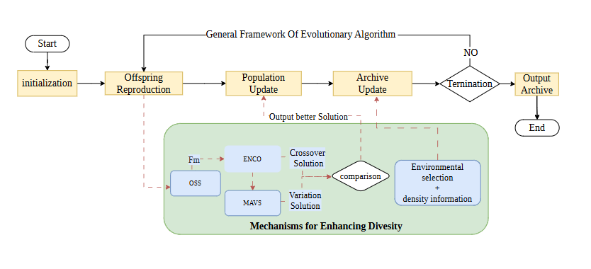

# D-NSGA2Plus

> Public C++ implementation of **Intercity Ride-sharing Routing: A Diversity-enhanced Non-dominated Sorting Genetic Algorithm II**, a diversity-enhanced NSGA-II algorithm for multi-objective intercity ride-sharing routing optimization.

[](LICENSE)
[](#installation)
[](#dataset-preparation)

## Overview

This repository contains the public experimental implementation of **D-NSGA2+** for the multi-objective vehicle routing problem in intercity ride-sharing. The implementation includes the complete paper-version mechanisms used in our experiments:

- IoP/SPO-based dynamic objective selection.
- Adaptive operator selection with PM, AP, and MAB modes.
- Eight mutation operators for route-level, trip-level, and order-level perturbation.
- Optional preprocessing controlled by a reproducible experiment switch.
- External archive update with nondominated and epsilon-box filtering.
- Run configuration logging for reproducible experiments and ablation studies.

The benchmark data are maintained separately in the public dataset repository. This code repository only keeps the expected `data/` layout and task-list templates.

## News / Updates

- `2026-06-14`: Initial public code release with reproducible configuration files, relative-path dataset loading, and HV/IGD evaluation notes.

## Framework

<p align="center">
  
</p>

## Repository Structure

```text
.
|-- ExperimentConfig.h        # Experiment parameters, ablation switches, and random seed settings
|-- NSGA2.cpp                 # Main workflow, IoP/SPO objective selection, output, and run logging
|-- Individual.cpp            # Initialization, mutation operators, AOS, and archive update
|-- Population.cpp            # Population initialization and environmental selection
|-- data/                     # Dataset placement instructions and task-list templates
|-- docs/                     # Reproducibility notes, parameter records, and public assets
|-- examples/                 # Minimal sanity-check instructions
|-- CITATION.cff              # Citation metadata
`-- LICENSE                   # Open-source license
```

## Installation

### 1. Clone this repository

```bash
git clone https://github.com/IOAS-HQU/D-NSGA2Plus.git
cd D-NSGA2Plus
```

### 2. Install build tools

Recommended environment:

- Windows 10/11
- Visual Studio 2022/2026 or MSVC C++ Build Tools
- C++17 support

### 3. Build with MSVC

Run the following command in Visual Studio Developer PowerShell, or in a terminal where `vcvars64.bat` has been loaded:

```powershell
cl /nologo /EHsc /std:c++17 /utf-8 /FeDNSGA2.exe NSGA2.cpp Individual.cpp Population.cpp pch.cpp
```

You may also create a Visual Studio C++ console project and add the source files manually. Keeping `/utf-8` is recommended because the historical source code contains non-ASCII comments and console messages.

## Dataset Preparation

The benchmark data are not duplicated in this repository. Download them from the public dataset repository:

```bash
git clone https://github.com/IOAS-HQU/DataSet.git
```

Then place the required CSV files under this repository's `data/` directory. The expected runtime layout is:

```text
data/
|-- realworld_45/
|   |-- data/
|   |   |-- Mytxt.txt
|   |   `-- processed/
|   `-- time-distance-matrix/
|       |-- src-src-time/
|       |-- dest-dest-time/
|       |-- dest-src-time/
|       |-- src-dest-time/
|       |-- src-src-dis/
|       |-- dest-dest-dis/
|       |-- dest-src-dis/
|       `-- src-dest-dis/
`-- solomon_36/
    |-- data/
    |   |-- Mytxt.txt
    |   |-- c/
    |   |-- r/
    |   `-- rc/
    `-- time-distance-matrix/
```

This repository tracks the directory skeleton and the two task-list files:

```text
data/realworld_45/data/Mytxt.txt
data/solomon_36/data/Mytxt.txt
```

Large CSV files should be copied from the dataset repository into the corresponding folders before running. See [data/README.md](data/README.md) for detailed placement instructions.

## Quick Start

After building `DNSGA2.exe` and preparing the dataset files, run:

```powershell
.\DNSGA2.exe
```

By default, the program reads the task list configured in `ExperimentConfig.h` and writes outputs to:

```text
Result/
Stage/
```

For a minimal sanity check, see [examples/README.md](examples/README.md).

## Configure Experiments

Main settings are centralized in `ExperimentConfig.h`:

- `EXPERIMENT_TASK_START` / `EXPERIMENT_TASK_END`: task range.
- `EXPERIMENT_RUN_COUNT`: independent runs per task. The paper-style default is 30.
- `EXPERIMENT_NOI_LIMIT`: inner iterations per generation. The paper-style default is 50.
- `EXPERIMENT_OBJECTIVE_MODE`: objective-selection mode. The complete mechanism uses `OBJECTIVE_IOP_SPO`.
- `EXPERIMENT_AOS_MODE`: adaptive operator selection mode. The default is `AOS_PM`.
- `EXPERIMENT_ENABLE_PREPROCESSING`: preprocessing switch.
- `EXPERIMENT_MUTATION_OPERATOR_ENABLED`: M1-M8 mutation-operator switches.
- `EXPERIMENT_USE_FIXED_SEED` / `EXPERIMENT_BASE_SEED`: reproducible random-seed settings.

See [docs/EXPERIMENT_SETTINGS.md](docs/EXPERIMENT_SETTINGS.md) for the public hyperparameter record.

## Generated Results

After a run, outputs are written under the current working directory:

- `Result/task X result Y .txt`: output of task `X` in independent run `Y`. Each line contains the four objective values of one solution.
- `Result/task X final result.txt`: final nondominated set for task `X`, produced by merging the run-level EP outputs of the same task and applying nondominated filtering.
- `Result/run_config.txt`: actual configuration used in the run, including experiment switches and random-seed settings.
- `Stage/`: optional intermediate archive output for inspecting the evolutionary process.

`Result/` and `Stage/` are intentionally ignored by Git.

## Evaluation Protocol

Recommended evaluation settings:

- Treat all four objectives as minimization objectives.
- Compute HV and IGD task by task.
- Deduplicate each run-level result and keep nondominated points before metric calculation.
- Use common task-level ideal and nadir points for normalization across compared methods.
- Use `[1.1, 1.1, 1.1, 1.1]` as the normalized HV reference point.
- For IGD, build the task-level reference front by merging normalized nondominated points from all methods and runs included in the same comparison, then applying nondominated filtering again.

See [docs/REPRODUCIBILITY.md](docs/REPRODUCIBILITY.md) for a concise record of the metric settings.

## Main Results

Paper tables and figures should be generated from `Result/` files using the evaluation protocol above. Generated outputs are not included in this repository.

## Citation

If you use this code, please cite the associated paper. A placeholder citation file is provided in [CITATION.cff](CITATION.cff) and should be updated with the final bibliographic information after publication.

```bibtex
@article{dnsga2plus_intercity_ridesharing,
  title   = {A Diversity-Enhanced Multi-Objective Optimization Algorithm for Intercity Ride-Sharing},
  author  = {Author Name and Collaborators},
  journal = {To appear},
  year    = {2026}
}
```

## Acknowledgements

We thank the maintainers of the benchmark datasets used in the experiments.

## License

This project is released under the MIT License. See [LICENSE](LICENSE).

## Known Limitations

- The source code inherits some historical console output. For formal experiments, rely on result files and `Result/run_config.txt` rather than console text.
- The repository provides algorithm code and reproducibility instructions. Large dataset files and generated experiment outputs are intentionally excluded from version control.
- If `ExperimentConfig.h` is modified for ablation studies, keep the corresponding `Result/run_config.txt` with the generated results.
